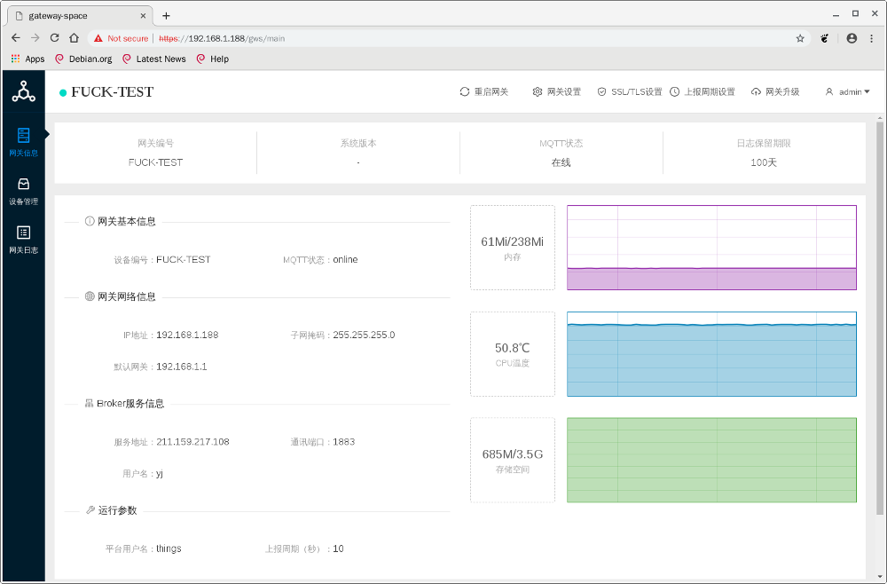
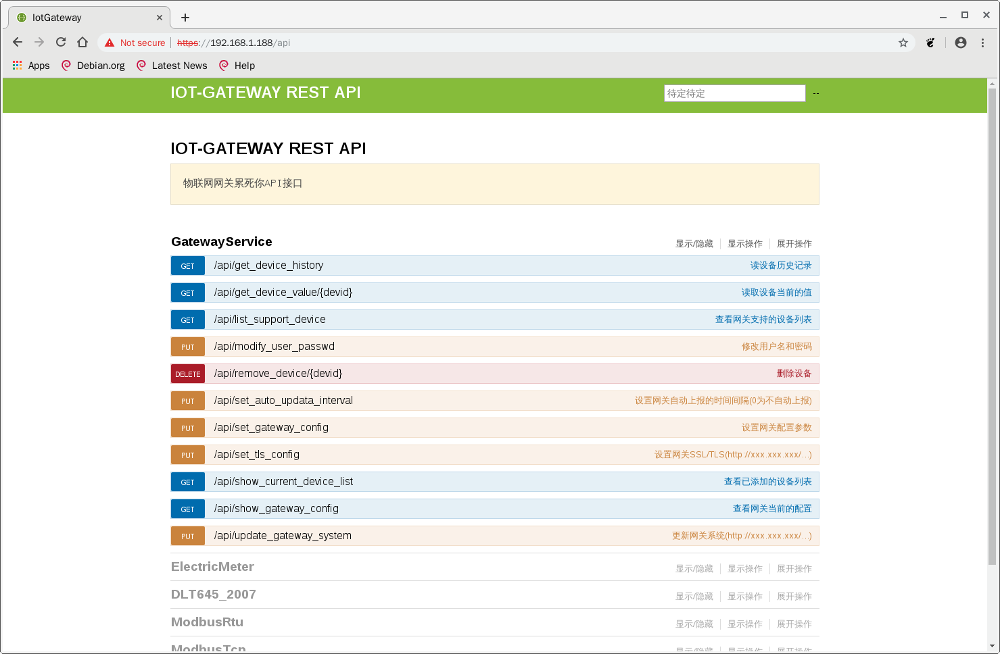
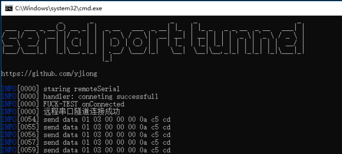
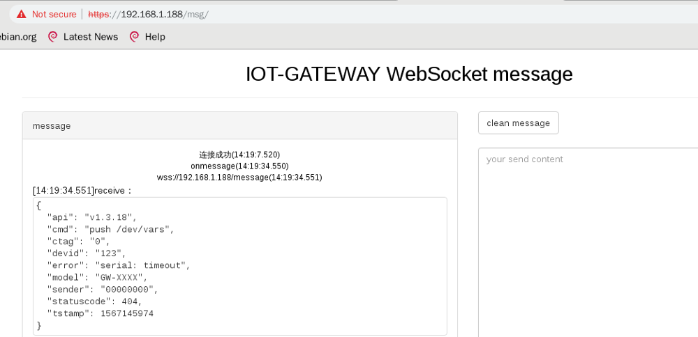

# Iot-GATEWAY

### 简单介绍一下 
* 目标是将各种仪表,传感器,工业控制端,通过该网关转换成应用服务最容易接受的协议,并且以最简单最容易开发的形式提供给前端.
* 基于linux arm环境(当然你可以在x86构架上跑)
* 可以通过web页面管理网关.所有功能命令都可以在mqtt下完成.支持restful api接口,支持websocket实时通信.
* 远程串口隧道功能,你可以通过该功能,将远程设备的串口(普通串口,rs485,422等)虚拟到本地.你可以利用该功能远程开发设备驱动.或者远程给plc什么的下载梯形图程序.


## Installation

### ubuntu and debian:

arm64安装包[arm64.deb]

armhf安装包[armhf.deb]

amd64安装包[amd64.deb]

uname -m 查看你的cpu构架,选择对应的deb包

```sh
sudo apt-get update
sudo apt-get --no-install-recommends -y install net-tools postgresql
sudo -u postgres psql -c "ALTER user postgres WITH password 'gateway';"
sudo dpkg -i gateway-xxx-v1.3.deb
sudo setid gatewayid gatewaymodel (设置网关编号和型号)
```
web登录端口80,默认用户名admin,密码123456  


rest api 调试页面(未开启用户验证,直接可以操作):  


远程串口隧道客户端:  
  
  
串口隧道客户端[serial-tunnel],使用方法详见包内介绍


## Usage example  

_注:该版本屏蔽了用户验证,仅供测试_

_服务和iot网关的通信报文举例详见wiki_
_For more examples and usage, please refer to the [Wiki][wiki]._

websocket 实时查看页面(未开启用户验证,直接可以操作)    
  

_注:上报周期interval不等于0的情况下,网关将每隔interval秒推送一次所有device实时数据_

websocket 获取数据举例(python)(未开启用户验证,直接可以操作)    

```sh
>>> import websocket
>>> import ssl
>>> import json
>>> ws=websocket.WebSocket(sslopt={"cert_reqs":ssl.CERT_NONE})
>>> ws.connect("wss://192.168.1.188/message")
>>> print json.dumps(json.loads(ws.next()),indent=4)
{
    "ctag": "0", 
    "devid": "123", 
    "sender": "FUCK-TEST", 
    "cmd": "push /dev/vars", 
    "tstamp": 1567143623, 
    "api": "v1.3.18", 
    "error": "serial: timeout", 
    "model": "GW-XXXX", 
    "statuscode": 404
}
>>> 
```


## Release History

* 1.3
    * CHANGE: add rest api


## Meta
jiong yao – yjiong@msn.com

Distributed under the XYZ license. See ``LICENSE`` for more information.

[https://github.com/yjiong/iotgateway](https://github.com/yjiong/)

## Contributing

1. Fork it (<https://github.com/yjiong/iotgateway/fork>)
2. Create your feature branch (`git checkout -b feature/fooBar`)
3. Commit your changes (`git commit -am 'Add some fooBar'`)
4. Push to the branch (`git push origin feature/fooBar`)
5. Create a new Pull Request

<!-- Markdown link & img dfn's -->
[wiki]: https://github.com/yjiong/iotgateway/wiki
[armhf.deb]:https://github.com/yjiong/iotgateway/releases/download/v1.3/gateway-armhf-v1.3.deb
[arm64.deb]:https://github.com/yjiong/iotgateway/releases/download/v1.3/gateway-arm64-v1.3.deb
[amd64.deb]:https://github.com/yjiong/iotgateway/releases/download/v1.3/gateway-amd64-v1.3.deb
[serial-tunnel]:https://github.com/yjiong/iotgateway/releases/download/v1.3/serial-tunnel-win.zip